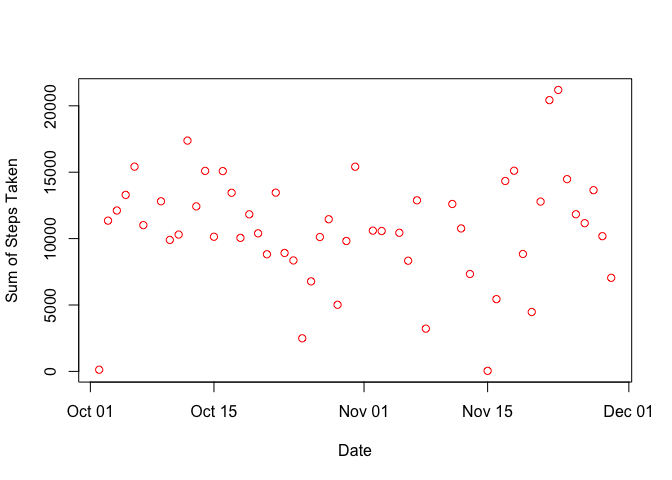
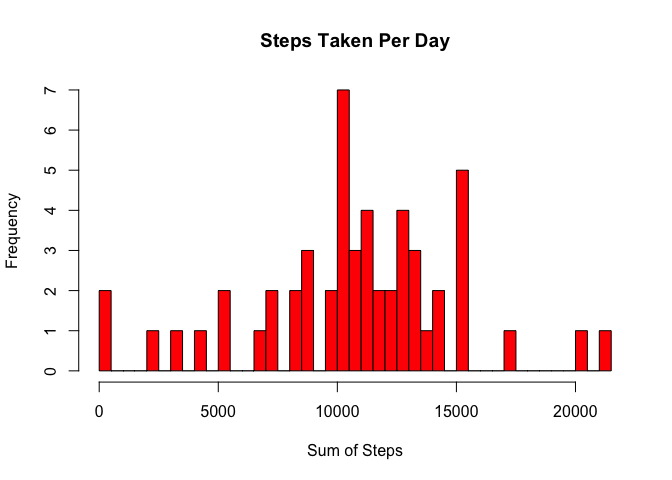
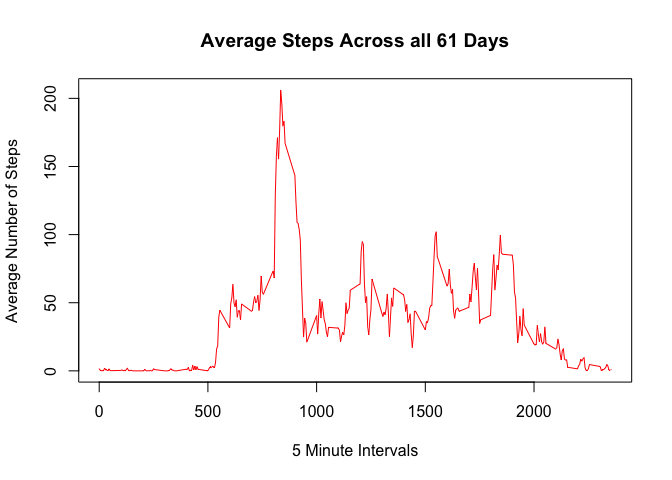
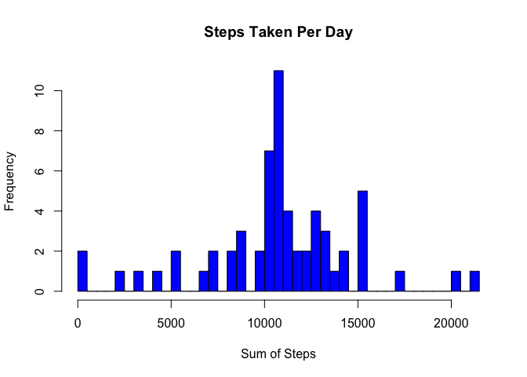
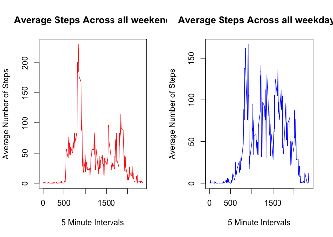

# Reproducible Research: Peer Assessment 1


## Loading and preprocessing the data

```r
dat<-read.csv('activity.csv',header=TRUE,sep=",",na.strings=as.character(NA))
dat$date<-as.Date(dat$date,'%Y-%m-%d')
```

## What is mean total number of steps taken per day?

```r
#Remove 'NA'from data:
newdata<-dat[which(dat$steps != 'NA'),]

#Split data into different data.frames based on dates:
byDates <- split(newdata,f=newdata$date)

#Calculate the steps taken per day:
dateUnique<-unique(newdata$date)
summ<-vector(mode="numeric",length=length(dateUnique))
for(i in 1:length(byDates)){
        summ[i]<-sum(byDates[[i]]$steps)}

#Plot of total number of steps taken per day:
plot(summ~dateUnique,col='Red',ylab='Sum of Steps Taken',xlab='Date')
```

 

```r
#Hist of total number of steps taken per day:
hist(summ,col='red',breaks=length(dateUnique),xlab='Sum of Steps',
        main='Steps Taken Per Day')
```

 

```r
#Mean and Median of the total number of steps taken per day:
summary(summ)
```

```
##    Min. 1st Qu.  Median    Mean 3rd Qu.    Max. 
##      41    8841   10760   10770   13290   21190
```

## What is the average daily activity pattern?

```r
#Split data into different data.frames based on intervals:
byIntervals <- split(newdata,f=newdata$interval)

#Calculate the steps taken per interval:
intervalUniq <- unique(newdata$interval)
averSteps<-vector(mode="numeric",length=length(intervalUniq))
for(i in 1:length(intervalUniq)){
        averSteps[i]<-mean(byIntervals[[i]]$steps)}

#Time series plot of 5 minute interval vs. average number of steps taken:
plot(intervalUniq,averSteps,type='l',col='red',xlab='5 Minute Intervals',
     ylab='Average Number of Steps',main='Average Steps Across all 61 Days')
```

 

```r
#Determine time interval for max(averSteps):
Max<-max(averSteps);INDEX<-which(averSteps==Max,arr.ind=TRUE)
intervalUniq[INDEX]
```

```
## [1] 835
```

```r
#So, 8:30-8:35 am has, on average, the most number of steps!

#Note that above I used the data with the 'NA' values omitted. Attempting to plot with
#NA values gives error. I am sure that one can use as.Factor(NA), but plotting 'NA' values
#doesn't make sense to me.
```


## Imputing missing values

```r
#Total number of missing values in the dataset:
newdata<-dat[which(dat$steps != 'NA'),]
Dim1<-dim(dat);Dim2<-dim(newdata)
total_NA<-Dim1[1]-Dim2[1];total_NA
```

```
## [1] 2304
```

```r
#Determine location of "NA" in data and replace by mean for 5 minute interval:
for(i in 1:Dim1[1]){
        if(is.na(dat[i,1])==TRUE){
                index<-which(dat$interval[i]==intervalUniq,arr.ind=TRUE)
                dat$steps[i]=averSteps[index]
        }
}

#Split data into different data.frames based on dates:
byDates <- split(dat,f=dat$date)

#Calculate the steps taken per day:
dateUnique<-unique(dat$date)
Summ<-vector(mode="numeric",length=length(dateUnique))
for(i in 1:length(byDates)){
        Summ[i]<-sum(byDates[[i]]$steps)}

#Hist of total number of steps taken each day:
hist(Summ,col='blue',breaks=length(dateUnique),xlab='Sum of Steps',
        main='Steps Taken Per Day')
```

 

```r
#Mean and Median of the total number of steps taken per day:
summary(Summ)
```

```
##    Min. 1st Qu.  Median    Mean 3rd Qu.    Max. 
##      41    9819   10770   10770   12810   21190
```

```r
#Yes, the values in this summary report differ from the summary report from the first part of assign.
#We see that the impact of replacing the "NA" step values in 'dat' with average steps of intervals 
#is that the mean=median which implies that the data becomes more normally distributed.
#This is very helpful because it makes using linear models more appropriate.
```


## Are there differences in activity patterns between weekdays and weekends?

```r
library(chron)

#Adds boolean column to 'dat' which returns True if date is weekend, false otherwise:
dat$weekend = chron::is.weekend(dat$date)
facVar<-factor(c('weekend','weekday'))
N<-length(dat$weekend)
for(i in 1:N){
        if(dat[i,4]==TRUE){
                dat[i,4]<-facVar[1]
                }
        else{
                dat[i,4]<-facVar[2]
        }
                
}

#Split data into different data.frames based on weekend or weekday:
byWeekEnd <- dat[which(dat$weekend==1),]
byWeekDay <- dat[which(dat$weekend==2),]

#Split byWeekEnd into different data.frames based on intervals:
IntervalsEnd <- split(byWeekEnd,f=byWeekEnd$interval)

#Split byWeekday into different data.frames based on intervals:
IntervalsDay <- split(byWeekDay,f=byWeekDay$interval)

#Calculate the steps taken per interval:
intervalUniq <- unique(dat$interval)
n<-length(intervalUniq)
AverSteps<-vector(mode="numeric",length=n)
AverSteps2 <- vector(mode="numeric",length=n)
for(i in 1:n){
        AverSteps[i]<-mean(IntervalsEnd[[i]]$steps)
        AverSteps2[i]<-mean(IntervalsDay[[i]]$steps)}

#Time series plot of 5 minute interval vs. average number of steps taken:
par(mfrow=c(1,2))
plot(intervalUniq,AverSteps,type='l',col='red',xlab='5 Minute Intervals',
     ylab='Average Number of Steps',main='Average Steps Across all weekend')
plot(intervalUniq,AverSteps2,type='l',col='blue',xlab='5 Minute Intervals',
     ylab='Average Number of Steps',main='Average Steps Across all weekdays')
```

 

